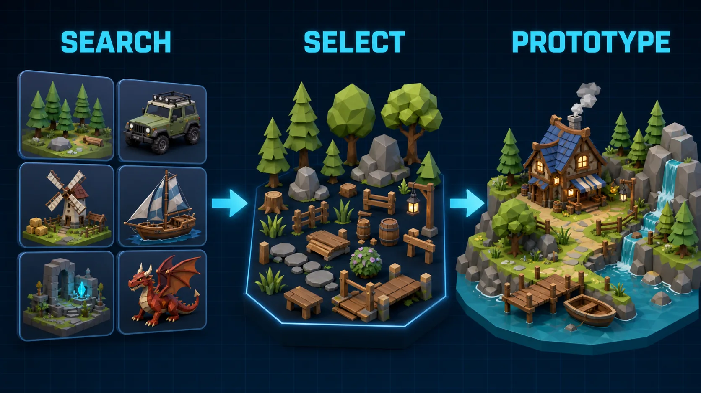

# DCC-MCP Quaternius Assets



Search and inspect free Quaternius asset packs.

## Install

```bash
dcc-mcp-cli marketplace add dcc-mcp/dcc-asset-quaternius
dcc-mcp-cli marketplace install dcc-asset-quaternius
```

## License And Usage

Quaternius pack pages mark their free packs as CC0 and describe them as free to
use in personal, educational, and commercial projects. Some pages offer source
kits or extra files through Patreon, itch.io, Discord, or Google Drive. This
skill returns the official pack/download page instead of bypassing those flows.

This skill returns `license_name`, `license_url`, and `usage_notice` in results.
After a user downloads the pack from its official page, `describe_quaternius_asset`
returns a validated `asset_descriptor` with the local file and CC0 attribution
for a DCC adapter import skill.

## Tools

- `search_quaternius_assets`
- `inspect_quaternius_asset`
- `describe_quaternius_asset`
