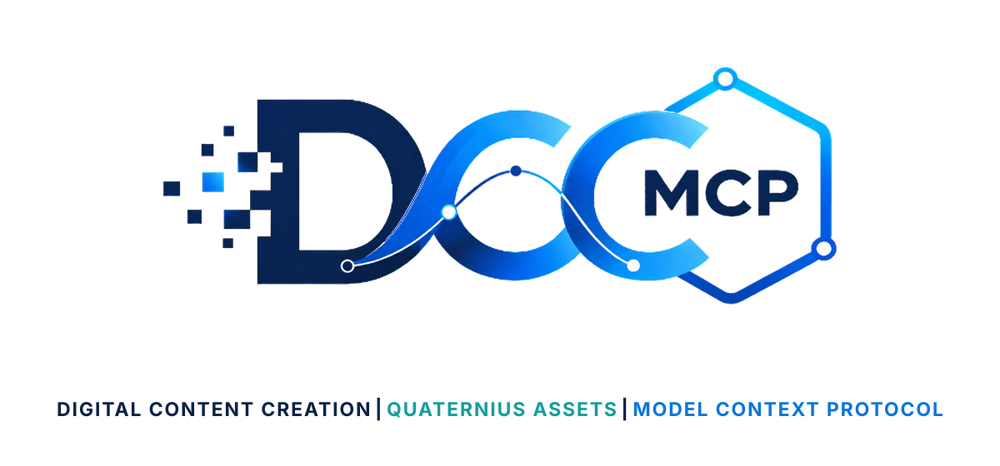

# DCC-MCP Quaternius Assets

<p align="center">
  
</p>

## Agent workflow

AI agents should use installed package skills through the shared gateway. IDE
users may continue to use the MCP endpoint.

```bash
dcc-mcp-cli dcc-types
dcc-mcp-cli list
dcc-mcp-cli search --query "<task>" --dcc-type <host>
dcc-mcp-cli describe <tool-slug>
dcc-mcp-cli call <tool-slug> --json '{"key":"value"}'
```

If the package skill is not active, call
`dcc-mcp-cli load-skill <skill-name> --dcc-type <host>`. After the task,
query `dcc-mcp-cli stats --range 24h --session-id <task-id>` and pass only
bounded evidence to the `review_skill_improvement` prompt from
`dcc-mcp-skills-creator`.


Search and inspect free Quaternius asset packs.

## Install

```bash
dcc-mcp-cli marketplace add dcc-mcp/dcc-asset-quaternius
dcc-mcp-cli marketplace install dcc-asset-quaternius
```

## License And Usage

Quaternius pack pages mark their free packs as CC0 and describe them as free to
use in personal, educational, and commercial projects. Some pages offer source
kits or extra files through Patreon, itch.io, Discord, or Google Drive. This
skill returns the official pack/download page instead of bypassing those flows.

This skill returns `license_name`, `license_url`, and `usage_notice` in results.
After a user downloads the pack from its official page, `describe_quaternius_asset`
returns a validated `asset_descriptor` with the local file and CC0 attribution
for a DCC adapter import skill.

## Tools

- `search_quaternius_assets`
- `inspect_quaternius_asset`
- `describe_quaternius_asset`
